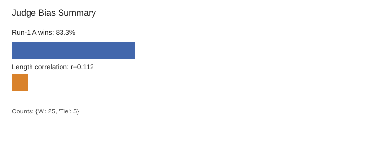

# Judge Bias Observations Report

## 1. Position Bias

- **A wins when listed first in run 1:** 83.3%
- **Run-1 winner counts:** {'A': 25, 'Tie': 5}
- **Mitigation:** Swap-and-average is applied; only consistent wins across both orderings become `winner_after_swap`.

## 2. Length Bias

- **Pearson correlation between `len(A)-len(B)` and final winner:** 0.112
- Version B is intentionally truncated, so preference for A indicates the judge rewards completeness.
- **Mitigation strategy:** Keep `conciseness` as a separate absolute-score dimension and add anti-padding language to the judge rubric.

## Chart

## Summary

| Bias Type | Magnitude | Mitigation |
|---|---:|---|
| Position bias | 83.3% A-first wins | Swap-and-average |
| Length bias | r=0.112 | Separate conciseness score + anti-padding rubric |
