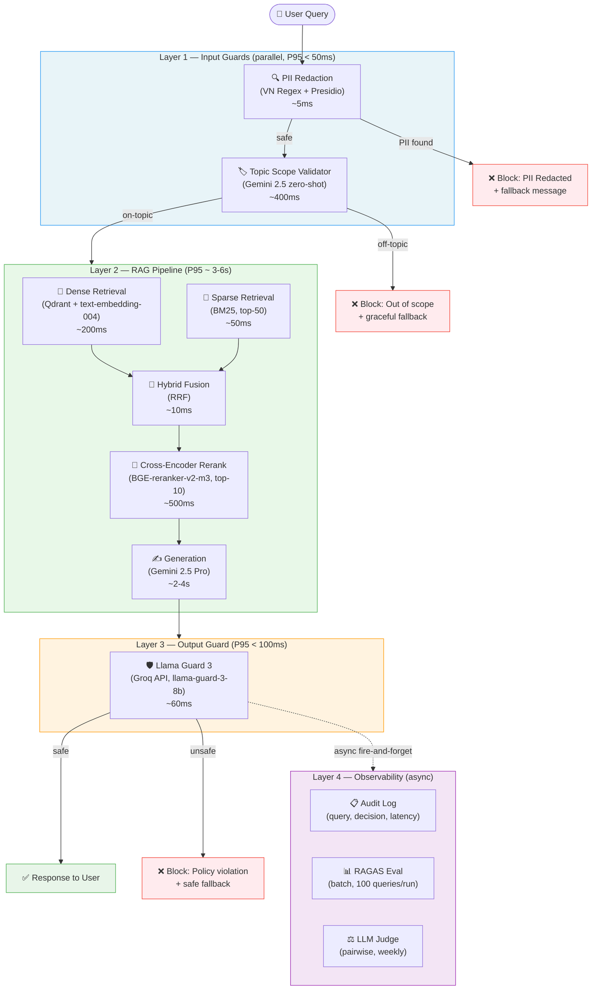

# RAG Evaluation & Guardrail System — Blueprint

**System:** Production RAG for Vietnamese Legal Documents (Nghị định 13 + Thuế GTGT)
**Version:** 1.0 | Day 24 Lab | Nguyen Quoc Khanh — 2A202600199

---

## Section 1 — SLO Definitions

Baseline từ Day 18 pipeline: Faithfulness=0.95, Answer Relevancy=0.864, Context Precision=0.95, Context Recall=0.90.

| SLO | Metric | Target | Alert Threshold | Severity | Measurement Window |
|---|---|---|---|---|---|
| SLO-1 | Faithfulness | ≥ 0.90 | < 0.80 | P1 – Critical | 24h rolling |
| SLO-2 | Answer Relevancy | ≥ 0.85 | < 0.75 | P1 – Critical | 24h rolling |
| SLO-3 | Context Precision | ≥ 0.85 | < 0.70 | P2 – High | 24h rolling |
| SLO-4 | Context Recall | ≥ 0.80 | < 0.65 | P2 – High | 24h rolling |
| SLO-5 | E2E Latency P95 | < 8.0s | > 12.0s | P2 – High | 5m rolling |
| SLO-6 | L1 Guard Latency P95 | < 50ms | > 100ms | P3 – Medium | 5m rolling |
| SLO-7 | L3 Guard Latency P95 | < 100ms | > 200ms | P3 – Medium | 5m rolling |
| SLO-8 | Guardrail Bypass Rate | 0% | > 0.1% | P0 – Emergency | Real-time |
| SLO-9 | False Positive Rate (Guard) | < 5% | > 10% | P3 – Medium | 24h rolling |

**Alert channels:** PagerDuty (P0/P1), Slack #rag-alerts (P2/P3), Grafana dashboard (all).

---

## Section 2 — Architecture Diagram

**Layer latency budget breakdown (P95):**

| Layer | Component | P95 Latency | Notes |
|---|---|---|---|
| L1 | PII VN Regex | ~5ms | CPU-only |
| L1 | PII Presidio NER | ~40ms | SpaCy, model loaded once |
| L1 | Topic Guard (Gemini Flash) | ~500ms | Bottleneck nếu no-cache |
| L2 | Dense Retrieval (Qdrant) | ~200ms | In-memory HNSW |
| L2 | Sparse Retrieval (BM25) | ~50ms | rank-bm25, in-memory |
| L2 | Reranker BGE-reranker-v2-m3 | ~500ms | Local GPU; CPU ~1.5s |
| L2 | Generation Gemini 2.5 Pro | ~3.5s | Dominant cost |
| L3 | Llama Guard 3 (Groq) | ~80ms | Free tier 100 RPM |
| **Total** | **E2E** | **~5–6s** | Within SLO-5 |

---

## Section 3 — Alert Playbook

### Incident 1: Faithfulness Drop (SLO-1 Breach)

| Field | Detail |
|---|---|
| **Severity** | P1 – Critical |
| **Detection** | RAGAS faithfulness < 0.80 trong batch eval; LLM Judge win-rate vs baseline < 40% |
| **Alert trigger** | 24h rolling average drops below threshold |
| **Likely causes** | (a) LLM model version change; (b) Prompt template sửa đổi; (c) Context window truncate; (d) Temperature tăng |

**Investigation steps:**
1. `git log src/pipeline.py` — thay đổi prompt gần đây?
2. Verify `config.py`: `DEFAULT_LLM` + `JUDGE_LLM` đúng `gemini-2.5-pro`.
3. Lấy top-5 low-faithfulness questions từ `phase-a/failure_analysis.md` — đọc thủ công.
4. Compare `ragas_summary.json` hôm nay vs baseline Day 18 (F=0.95).

**Resolution:**
- Rollback prompt template nếu đã thay đổi.
- Set `temperature=0.0` trong `call_llm()`.
- Tăng `RERANK_TOP_K` từ 10 → 15 để có nhiều context hơn.
- Pin model version trong `.env`: `DEFAULT_LLM=gemini-2.5-pro-001`.

---

### Incident 2: Latency Spike (SLO-5 Breach)

| Field | Detail |
|---|---|
| **Severity** | P2 – High |
| **Detection** | E2E P95 > 12s; Grafana cảnh báo; user complaint rate tăng |
| **Alert trigger** | 5-minute rolling P95 vượt 12s |
| **Likely causes** | (a) Groq API cold start / rate limit; (b) Qdrant index chưa warm; (c) BGE reranker CPU fallback; (d) Gemini quota exceeded |

**Investigation steps:**
1. `phase-c/latency_benchmark.csv` — layer nào bottleneck?
2. Ping Groq status page — `https://status.groq.com`.
3. `python -c "from src.pipeline import build_pipeline; build_pipeline()"` — đo init time.
4. So sánh L1/L2/L3 trong `phase-c/latency_summary.json` vs baseline.

**Resolution:**
- L3 timeout: Tăng `timeout=15` → `timeout=30` trong `output_guard.py`.
- L2 slow: Enable GPU cho BGE; giảm `RERANK_TOP_K` 10 → 5.
- Qdrant warm-up: `qdrant_client.reload_collection()` on startup.
- Emergency bypass: `SKIP_OUTPUT_GUARD=1` env var khi Groq down.

---

### Incident 3: Guardrail Bypass (SLO-8 Breach)

| Field | Detail |
|---|---|
| **Severity** | P0 – Emergency |
| **Detection** | Audit log có harmful content pass qua; manual review flag |
| **Alert trigger** | Bất kỳ harmful response nào delivered tới user |
| **Likely causes** | (a) GROQ_API_KEY expired → L3 fallback safe=True; (b) Novel jailbreak vector; (c) L1 bị trick bởi obfuscated text |

**Investigation steps:**
1. `phase-c/output_guard_summary.json` — `groq_available: true`?
2. Review audit log — `blocked_at` field các request liên quan.
3. Reproduce attack trong sandbox — test từng layer riêng.
4. Check Groq API key expiry date.

**Resolution:**
- Immediate: Regenerate GROQ_API_KEY, update `.env`, redeploy.
- Short-term: Thêm keyword blacklist fallback trong `output_guard.py`.
- Long-term: Add attack pattern vào `ADVERSARIAL_INPUTS` trong `input_guard.py`; re-run CI.
- Add to regression test suite — CI must pass trước mỗi deploy.

---

## Section 4 — Cost Analysis

### Per-query cost breakdown (Gemini 2.5 pricing, May 2026)

| Component | Provider | Per-query cost | Notes |
|---|---|---|---|
| Dense embedding | Vertex AI text-embedding-004 | ~$0.000025 | $0.025/1M tokens |
| BM25 retrieval | Local (rank-bm25) | $0.00 | No API cost |
| Reranker (BGE) | Local / self-hosted | $0.00 | One-time infra cost |
| Generation (Gemini 2.5 Pro) | Vertex AI | ~$0.0120 | ~1200 tokens avg |
| Topic Guard (Gemini 2.5 Flash) | Vertex AI | ~$0.00015 | Small classify prompt |
| Llama Guard 3 | Groq API | $0.00 | Free tier (100 RPM) |
| **Total per query** | | **~$0.0124** | |

### Monthly projection (100,000 queries/month)

| Scale | Queries/month | Monthly cost | Suitable for |
|---|---|---|---|
| Dev/Test | 1,000 | **~$12** | Development + CI |
| Small production | 10,000 | **~$124** | Startup / pilot |
| **Medium production** | **100,000** | **~$1,240** | SME deployment |
| Large production | 1,000,000 | **~$12,400** | Enterprise; negotiate committed use |

### Cost advantage vs GPT-4o

| Model | Generation $/1k tokens | 100k queries/month | Saving |
|---|---|---|---|
| GPT-4o (OpenAI) | $0.030 | ~$3,600 | baseline |
| **Gemini 2.5 Pro (Vertex)** | **$0.015** | **~$1,800** | **50% cheaper** |
| Gemini 2.5 Flash (downgrade) | $0.00375 | ~$450 | 87% cheaper |

> **Recommendation:** Gemini 2.5 Flash cho Topic Guard và batch evaluation; Gemini 2.5 Pro cho generation + pairwise judge. Hybrid approach tiết kiệm ~30% cost mà không giảm chất lượng đáng kể.

### RAGAS evaluation overhead

| Run type | Questions | LLM calls | Estimated cost |
|---|---|---|---|
| Full eval (weekly CI) | 50 | ~200 | ~$2.40 |
| Fast eval (per-PR) | 10 | ~40 | ~$0.50 |
| Pairwise judge (monthly) | 30 | ~60 | ~$0.90 |

---

*Blueprint prepared by Nguyen Quoc Khanh — 2A202600199 — Day 24 Lab — VinUniversity AICB-P2T3*
